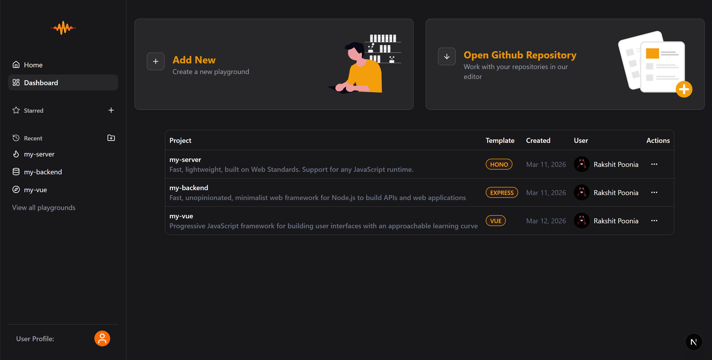

# 🧠 Vibecode Editor – AI-Powered Web IDE



**Vibecode Editor** is a blazing-fast, AI-integrated web IDE built entirely in the browser using **Next.js App Router**, **WebContainers**, **Monaco Editor**, and **local LLMs via Ollama**. It offers real-time code execution, an AI-powered chat assistant, and support for multiple tech stacks — all wrapped in a stunning developer-first UI.

Demo Video Link : https://youtu.be/if4zJj9APdI

---

## 🚀 Features

- 🔐 **OAuth Login with NextAuth** – Supports Google & GitHub login.
- 🎨 **Modern UI** – Built with TailwindCSS & ShadCN UI.
- 🌗 **Dark/Light Mode** – Seamlessly toggle between themes.
- 🧱 **Project Templates** – Choose from React, Next.js, Express, Hono, Vue, or Angular.
- 🗂️ **Custom File Explorer** – Create, rename, delete, and manage files/folders easily.
- 🖊️ **Enhanced Monaco Editor** – Syntax highlighting, formatting, keybindings, and AI autocomplete.
- 💡 **AI Suggestions with Ollama** – Local models give you code completion on `Ctrl + Space` or double `Enter`. Accept with `Tab`.
- ⚙️ **WebContainers Integration** – Instantly run frontend/backend apps right in the browser.
- 💻 **Terminal with xterm.js** – Fully interactive embedded terminal experience.
- 🤖 **AI Chat Assistant** – Share files with the AI and get help, refactors, or explanations.
- 💾 **MongoDB-backed persistence** – Store user and project-related metadata in MongoDB.

---

## 🧱 Tech Stack

| Layer         | Technology                    |
| ------------- | ----------------------------- |
| Framework     | Next.js 16 (App Router)       |
| Styling       | TailwindCSS, ShadCN UI        |
| Language      | TypeScript                    |
| Auth          | NextAuth (Google + GitHub)    |
| Editor        | Monaco Editor                 |
| AI Suggestion | Ollama (LLMs running locally) |
| Runtime       | WebContainers                 |
| Terminal      | xterm.js                      |
| Database      | MongoDB (via `DATABASE_URL`)  |

---

## 💻 System Requirements

Because this project uses **local LLMs via Ollama**, it is recommended to run it on a **high-performance system**:

- **CPU/GPU**: Modern multi-core CPU, dedicated GPU strongly recommended for larger models
- **RAM**: At least **16 GB** recommended (more for bigger models)
- **Disk**: Sufficient space for Ollama models

**Note:** Offline LLM models require a high-performance system; otherwise, responses will be **very slow** or may be **unavailable** if the model cannot be loaded into memory.

---

## 🛠️ Getting Started (Local Development)

### 1. Clone the Repo

```bash
git clone https://github.com/your-username/vibecode-editor.git
cd vibecode-editor
```

### 2. Install Dependencies

```bash
npm install
```

### 3. Set Up Environment Variables

Create a `.env.local` file using the template:

```bash
cp .env.example .env.local
```

Then, fill in your credentials:

```env
AUTH_SECRET=your_auth_secret
AUTH_GOOGLE_ID=your_google_client_id
AUTH_GOOGLE_SECRET=your_google_secret
AUTH_GITHUB_ID=your_github_client_id
AUTH_GITHUB_SECRET=your_github_secret
DATABASE_URL=your_mongodb_connection_string
NEXTAUTH_URL=http://localhost:3000
```

### 4. Start Local Ollama Model

Make sure [Ollama](https://ollama.com/) is installed and at least one code-capable model is available, then run:

```bash
ollama run codellama
```

Or use your preferred model that supports code generation. (codellama:latest has been used in this project so for proper working on local host install this model)

### 5. Run the Development Server

```bash
npm run dev
```

Visit `http://localhost:3000` in your browser.

---

## ⚠️ Deployment / Hosting Limitations

Currently, this project is **not suitable for hosting in production** as-is.

At startup, the playground **loads template data directly from a folder in the project’s root directory**, which works in local development but will **not work reliably in a typical production hosting environment** (e.g., serverless platforms, containerized deployments, or read-only file systems).

To make this production-ready, the template data needs to be moved to a persistent data store instead of relying on local files.

**Good OSS issue:** "to fix this add a collection in mongo db that stores templates and then load template data in playground using get request"

If you are interested in contributing, this would be a great feature to work on and discuss in an issue/PR.

---

## 📚 Deep Dives into Core Features

If you want to understand how some of the core features are implemented under the hood, refer to these feature-specific docs:

- **AI Chat Assistant internals** – `modules/ai-chat/CHAT_ASSISTANT.md`
- **AI Code Completion (inline suggestions)** – `modules/playground/AI_SUGGESTION.md`
- **Authentication & auth flow** – `AUTHFLOW.md`
- **File Explorer architecture** – `modules/playground/components/FILE_EXPLORER_ARCHITECTURE.md`

These documents walk through the intent, flow, and interaction between files for each feature, and are the best place to start if you want an explanation of how things work internally.

---

## 🎯 Keyboard Shortcuts

- `Ctrl + Space` or `Double Enter`: Trigger AI suggestions
- `Tab`: Accept AI suggestion
- `/`: Open Command Palette (if implemented)

---

## 🤝 Contributing

Contributions, feedback, and feature ideas are welcome!

- **Bug reports / Issues** – Use GitHub Issues to report bugs or suggest improvements.
- **Feature requests** – Open a discussion or issue to propose new functionality (e.g., template storage in MongoDB, new language templates, improved AI workflows).
- **Pull requests** – Fork the repo, create a feature branch, and open a PR.

If you are looking for a meaningful contribution, consider tackling the **deployment limitation** by moving template data into MongoDB as described above.

---

## 📄 License

This project is licensed under the [MIT License](LICENSE).

---

## 🙏 Acknowledgements

- [Monaco Editor](https://microsoft.github.io/monaco-editor/)
- [Ollama](https://ollama.com/) – for offline LLMs
- [WebContainers](https://webcontainers.io/)
- [xterm.js](https://xtermjs.org/)
- [NextAuth.js](https://next-auth.js.org/)
