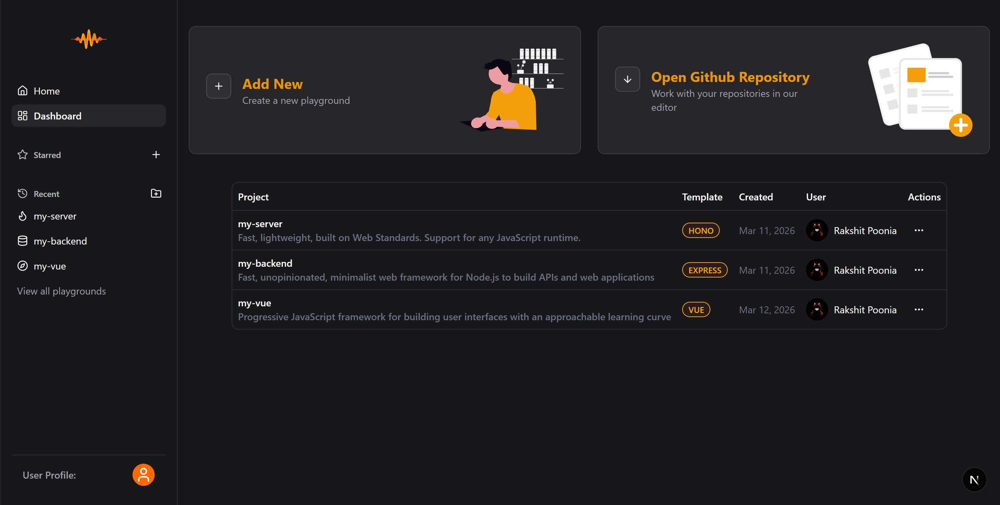

# 🧠 Vibecode Editor – AI-Powered Web IDE



**Vibecode Editor** is a blazing-fast, AI-integrated web IDE built entirely in the browser using **Next.js App Router**, **WebContainers**, **Monaco Editor**, and **LLMs via OpenRouter**. It offers real-time code execution, an AI-powered chat assistant, and support for multiple tech stacks — all wrapped in a stunning developer-first UI.

Demo Video Link : https://vibe-flow-two.vercel.app/

---

## 🚀 Features

- 🔐 **OAuth Login with NextAuth** – Supports Google & GitHub login.
- 🎨 **Modern UI** – Built with TailwindCSS & ShadCN UI.
- 🌗 **Dark/Light Mode** – Seamlessly toggle between themes.
- 🧱 **Project Templates** – Choose from React, Next.js, Express, Hono, Vue, or Angular.
- 🗂️ **Custom File Explorer** – Create, rename, delete, and manage files/folders easily.
- 🖊️ **Enhanced Monaco Editor** – Syntax highlighting, formatting, keybindings, and AI autocomplete.
- 💡 **AI Code Completion** – OpenRouter-hosted models give you inline code completion on `Ctrl + Space` or double `Enter`. Accept with `Tab`. Automatic model fallback keeps suggestions flowing if a model is unavailable.
- ⚙️ **WebContainers Integration** – Instantly run frontend/backend apps right in the browser.
- 💻 **Terminal with xterm.js** – Fully interactive embedded terminal experience.
- 🤖 **AI Chat Assistant** – Share files with the AI and get help, refactors, or explanations.
- 💾 **MongoDB-backed persistence** – Store user and project-related metadata in MongoDB.

---

## 🧱 Tech Stack

| Layer                | Technology                   |
| -------------------- | ---------------------------- |
| Framework            | Next.js 16 (App Router)      |
| Styling              | TailwindCSS, ShadCN UI       |
| Language             | TypeScript                   |
| Auth                 | NextAuth (Google + GitHub)   |
| Editor               | Monaco Editor                |
| AI Chat & Completion | OpenRouter (cloud LLMs)      |
| Runtime              | WebContainers                |
| Terminal             | xterm.js                     |
| Database             | MongoDB (via `DATABASE_URL`) |

---

## 🛠️ Getting Started (Local Development)

### 1. Clone the Repo

```bash
git clone https://github.com/rakshitpoonia/VibeFlow.git
cd VibeFlow
```

### 2. Install Dependencies

```bash
npm install
```

### 3. Set Up Environment Variables

Create a `.env` file using the template:

Then, fill in your credentials:

```env
AUTH_SECRET=your_auth_secret
AUTH_GOOGLE_ID=your_google_client_id
AUTH_GOOGLE_SECRET=your_google_secret
AUTH_GITHUB_ID=your_github_client_id
AUTH_GITHUB_SECRET=your_github_secret
DATABASE_URL=your_mongodb_connection_string
OPENROUTER_API_KEY=your_openrouter_api_key
NEXTAUTH_URL=http://localhost:3000
```

### 4. Get an OpenRouter API Key

The AI chat assistant and inline code completion call [OpenRouter](https://openrouter.ai/). Create an account, generate an API key, and set it as `OPENROUTER_API_KEY` (locally in `.env`, and in your hosting provider's environment variables when deploying). This project uses free-tier models, so no credits are required to get started.

### 5. Run the Development Server

```bash
npm run dev
```

Visit `http://localhost:3000` in your browser.

---

## ☁️ Deployment Notes

The app deploys cleanly to serverless platforms (e.g., Vercel):

- Starter template data lives in the **`StarterTemplate` MongoDB collection**. POST request made to this row once and all subsequent template environment creations are done by GET request to this collection
- AI features call **OpenRouter** server-side; set `OPENROUTER_API_KEY` in your hosting provider's environment variables.
- Register your production OAuth callback URLs (`/api/auth/callback/google` and `/api/auth/callback/github`) in the Google/GitHub developer consoles.

- This project uses free tier shared models so Rate Limits are quite frequent. The NVIDIA models used are fast and low latency. The choice for these models have been made on the basis of least frequency of rate limits.

---

## 📚 Deep Dives into Core Features

If you want to understand how some of the core features are implemented under the hood, refer to these feature-specific docs:

- **AI Chat Assistant internals** – `modules/ai-chat/CHAT_ASSISTANT.md`
- **AI Code Completion (inline suggestions)** – `modules/playground/AI_SUGGESTION.md`
- **Authentication & auth flow** – `AUTHFLOW.md`
- **File Explorer architecture** – `modules/playground/components/FILE_EXPLORER_ARCHITECTURE.md`

These documents walk through the intent, flow, and interaction between files for each feature, and are the best place to start if you want an explanation of how things work internally.

---

## 🎯 Keyboard Shortcuts

- `Ctrl + Space` or `Double Enter`: Trigger AI suggestions
- `Tab`: Accept AI suggestion

---

## 🤝 Contributing

Contributions, feedback, and feature ideas are welcome!

- **Bug reports / Issues** – Use GitHub Issues to report bugs or suggest improvements.
- **Feature requests** – Open a discussion or issue to propose new functionality (e.g., new language templates, improved AI workflows, streaming chat responses).
- **Pull requests** – Fork the repo, create a feature branch, and open a PR.

---

## 📄 License

This project is licensed under the [MIT License](LICENSE).

---

## 🙏 Acknowledgements

- [Monaco Editor](https://microsoft.github.io/monaco-editor/)
- [OpenRouter](https://openrouter.ai/) – unified LLM API
- [WebContainers](https://webcontainers.io/)
- [xterm.js](https://xtermjs.org/)
- [NextAuth.js](https://next-auth.js.org/)
